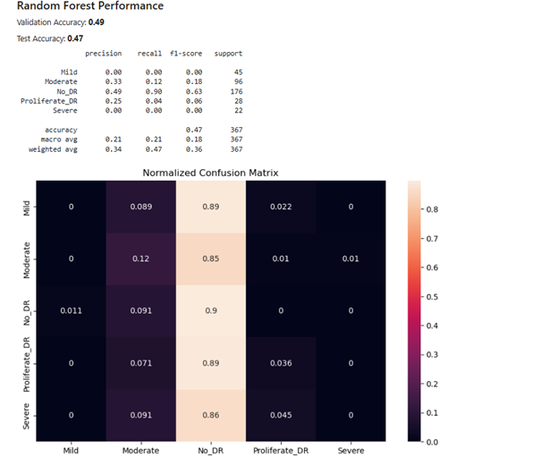

# 👁️ Enhancing Diabetic Retinopathy Diagnosis  
### A Hybrid Model Combining CNN Feature Extraction with Random Forest Classification

## 🧠 Overview

This project focuses on classifying the severity of **diabetic retinopathy (DR)** using a **hybrid machine learning model** that combines the power of **CNNs (MobileNetV2)** for feature extraction and **Random Forest Classifier (RFC)** for final classification. To improve clinical interpretability, the model leverages **LIME** to visualize decision-making regions on retinal images.

This hybrid approach balances moderate predictive accuracy with human-interpretable explanations, making it suitable for real-world healthcare applications.

---

## 🎯 Objectives

- Classify diabetic retinopathy into 5 levels (0–4) based on retinal scans
- Use CNNs for deep visual feature extraction
- Train a Random Forest on those features for interpretable classification
- Apply LIME for model transparency and decision region visualization

---

## 📁 Dataset

- **Source**: [APTOS 2019 Blindness Detection (Kaggle)](https://www.kaggle.com/competitions/aptos2019-blindness-detection/data)
- **Labels**: 0 = No_DR, 1 = Mild, 2 = Moderate, 3 = Severe, 4 = Proliferative_DR
- **Preprocessing**:
  - Resized to 224x224 pixels
  - Normalized pixel values to 0–1
  - Augmented with flips, zooms, and rotations
  - Split: 70% training, 15% validation, 15% testing

---

## 🛠️ Methodology

### 🧪 Modeling Approach

- **CNN Backbone**: Pre-trained MobileNetV2 (frozen base, custom FC layers)
- **Feature Extraction**: Flattened CNN embeddings
- **Classifier**: Random Forest Classifier trained on extracted features
- **Loss Function**: Categorical Cross-Entropy
- **Optimizer**: Adam
- **Epochs**: 10 (with early stopping)

### 🧠 Interpretability

- **LIME**: Applied to selected predictions to visualize which image regions led to a specific classification
- **Confusion Matrix**: Evaluated performance across all DR levels
- **Class Distribution Plot**: Verified dataset balance before training

---

## 📊 Results

| Metric            | Value     |
|-------------------|-----------|
| Validation Accuracy | 49%     |
| Test Accuracy       | 47%     |
| Recall (No_DR)      | 0.90    |
| F1-Score (No_DR)    | 0.63    |

- The hybrid CNN+RF model showed **strong performance in identifying No_DR class**, with LIME visualizations adding transparency.
- Although overall accuracy is moderate, the **interpretable nature** of the predictions is highly valuable for clinical trust.

---

### 🖼️ Visual Results




- **Left**: Class-wise performance with confusion matrix
- **Right**: LIME visual explanation highlighting decision regions in a No_DR sample

---

## 📂 Project Files

📁 diabetic-retinopathy-hybrid-model/
├── diabetic_retinopathy_hybrid.ipynb
├── images/
│ └── hybrid_model_results.png
├── requirements.txt
└── README.md


---

## ▶️ Getting Started

1. **Clone the repository**
```
git clone https://github.com/YOUR_USERNAME/diabetic-retinopathy-hybrid-model.git
cd diabetic-retinopathy-hybrid-model
Install dependencies

pip install -r requirements.txt
Launch the notebook


jupyter notebook diabetic_retinopathy_hybrid.ipynb
🧠 Key Takeaways
Hybrid models (CNN + Random Forest) can enhance both model performance and explainability

LIME visualizations help build clinical trust by clearly showing how predictions are made

The model is a step forward toward transparent medical AI solutions

📬 Contact
Ravi Mutthina
📍 Dallas, TX
📧 ravimutthina@gmail.com
🔗 LinkedIn

📝 License
This project is licensed under the MIT License.


---

### ✅ Next Step

Just make sure:
- Your image is named `hybrid_model_results.png`
- It’s inside a folder called `/images`
- Your notebook and this `README.md` are in the root directory

Let me know if you want help writing a **LinkedIn post** to show off this project, or to set up a **GitHub profile**
